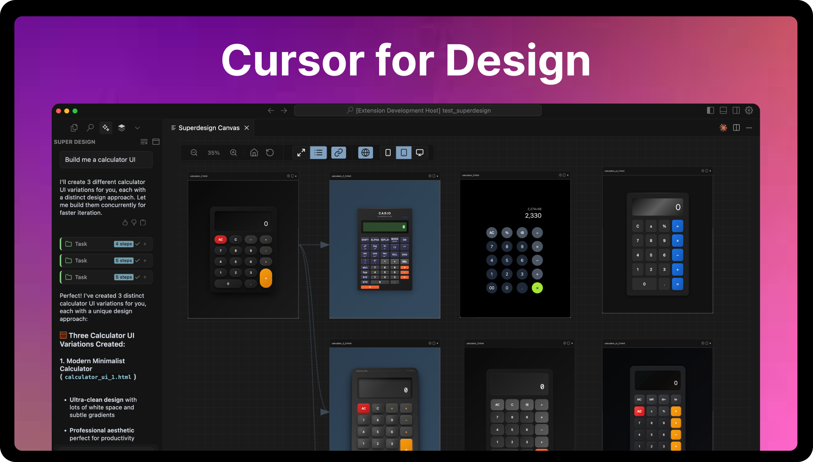
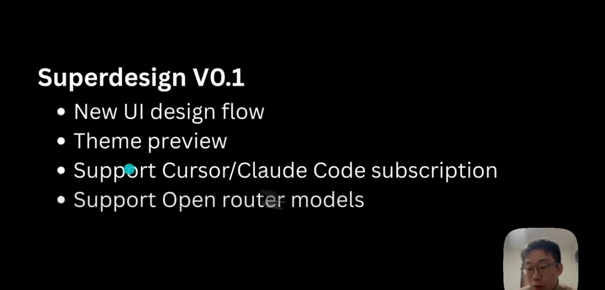

# 🧠 超级设计 — 您 IDE 中的 AI 设计助手

### **开发者:** [AI Jason](https://x.com/jasonzhou1993) & [JackJack](https://x.com/jackjack_eth)

超级设计是首个**开源设计助手**，直接集成在您的 IDE 中。  
通过自然语言提示生成 UI 模型、组件和线框图。  
与 Cursor、Windsurf、Claude Code 和普通 VS Code 无缝协作。

> ✨ "为什么只设计一个选项，当您可以探索十个？" — 超级设计

[加入 Discord 社区](https://discord.gg/FYr49d6cQ9)

[在 Hackernews 上投票](https://news.ycombinator.com/item?id=44376003)

[安装指南](https://www.superdesign.dev/)

---

## 🎬 演示视频 (点击播放)

---

## 🚀 功能特点

- 🖼️ **产品模型**: 通过一个提示立即生成完整 UI 界面
- 🧩 **UI 组件**: 创建可直接放入代码的可重用组件
- 📝 **线框图**: 探索低保真布局，实现快速迭代
- 🔁 **复制与迭代**: 轻松复制和改进设计
- 📥 **提示到 IDE**: 将提示复制到您喜欢的 AI IDE (Cursor、Windsurf、Claude Code)

---

## 🧠 完美兼容 Cursor、Windsurf、Claude Code、VS Code

👉 [点击安装](https://www.superdesign.dev/)

---

## 🛠️ 快速开始

1. 从 Cursor/VS Code 市场**安装扩展**
2. 打开`超级设计`侧边栏面板
3. 输入提示语(例如，_"设计一个现代登录界面"_)
4. 查看生成的模型、组件和线框图
5. 复制、调整并粘贴到您的项目中

---

## 我可以使用自己的 Claude Code 或 Cursor 订阅吗?

是的，在初始化超级设计扩展后，系统会添加一些 cursor/claude code 规则，这样您就可以提示代理进行设计并在超级设计画布中预览(cmd + shift + p -> 超级设计: 打开画布)

如果使用 Cursor - 我强烈建议复制'design.mdc'中的提示，并在 cursor 中创建具有相同系统提示的自定义模式；这将为您提供更好的性能

使用说明视频 (点击播放):

## 📂 我的设计存储在哪里?

您生成的设计本地保存在`.superdesign/`目录中。

---

## ❓ 常见问题

**它是免费和开源的吗?**  
是的！我们是开源的 — 您可以自由分叉、扩展或重新混合它。

**我可以定制设计助手吗?**  
可以 — 使用您自己的提示模板、修改行为或添加命令。

**超级设计可以更新现有 UI 吗?**  
当然可以 — 选择一个组件，描述更改，让助手完成剩下的工作。

**我如何贡献?**  
欢迎提交拉取请求。为仓库加星并加入我们的[Discord](https://discord.gg/XYZ)社区！

---

## 🔗 链接

- 🌐 网站: [https://superdesign.dev](https://superdesign.dev)
- 📦 GitHub: [https://github.com/shiyun0001/designcj](https://github.com/shiyun0001/designcj)
- 💬 Discord: [加入社区](https://discord.gg/XYZ)
- 🐦 Twitter / X: [@SuperDesignDev](https://x.com/SuperDesignDev)
